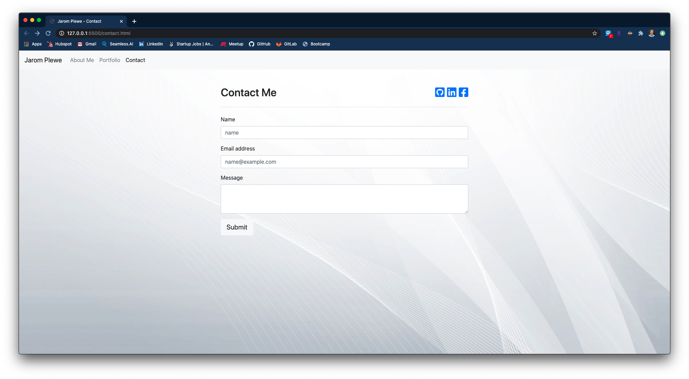
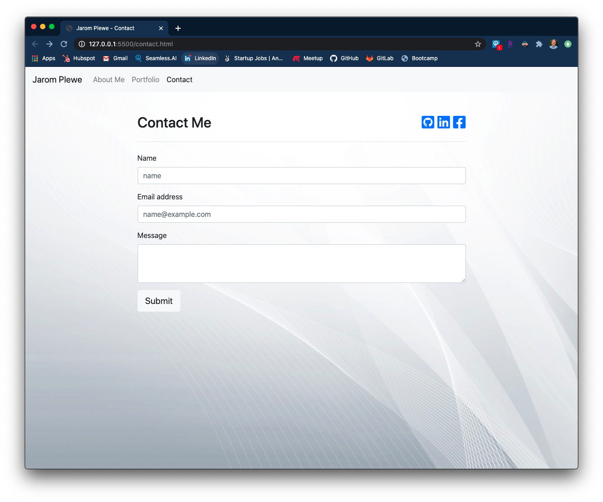
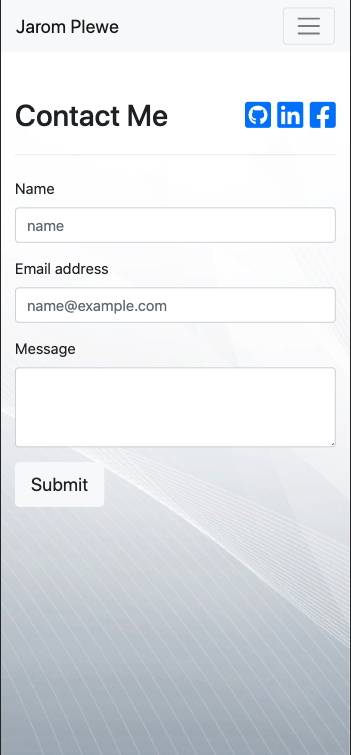

Portfolio

https://jaromplewe.github.io/portfolio/

I used bootstrap along with some minimal organic .css to create this responsive portfolio site. 

About me page at xl sizing:
.png)
.png)

Portfolio page at xl sizing:

Contact me page at xl sizing:

About me page at md sizing:
.png)
.png)

Portfolio page at md sizing:

Contact me page at md sizing:

About me page at xs sizing:
.png)
.png)

Portfolio page at xs sizing:

Contact me page at xs sizing:

